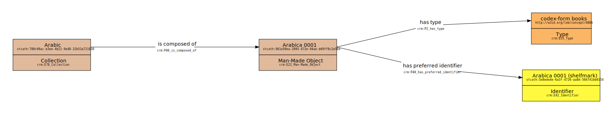

# CRMVIZ
Python command line tool and library for visualising RDF triples for datasets mapped to the [CIDOC-CRM](http://www.cidoc-crm.org/) ontology. This is based on:

* [rdflib](https://rdflib.readthedocs.io/en/stable/)
* [graphviz](https://pypi.org/project/graphviz/)

Supported CRM versions:
* CRM official: [6.2.1](http://www.cidoc-crm.org/sites/default/files/cidoc_crm_v6.2.1-2018April.rdfs) (default)
* Erlangen CRM: [current](http://erlangen-crm.org/ontology/ecrm/ecrm_current.owl)

Supported formats (from graphviz):
* svg (default)
* png

## Command line use

```commandline
python crmviz.py -v <crm_version> -f <format> [file]
```

Examples:
```commandline
python crmviz.py my-triples.rdf
```
This will run with default options and produce two files: `my-triples.gv` and `my-triples.gv.svg` using the labels and URIs from the official CIDOC-CRM (version 6.2.1).

```commandline
python crmviz.py -v erlangen -f png my-triples.rdf
```
This will produce two files: `my-triples.gv` and `my-triples.gv.png` using the labels and URIs from Erlangen CRM current. If no `-f` is specified then it will produce svg by default. If no `-v` is specified, then it will default to `forth` and the official CRM version is used. It makes sense to use the CRM version also used in your sample.

## Python use 

Example python use:

```python
from visualise import visualise_graph # import the library
graph = Graph() # create a new graph
graph.add((subject, predicate, object)) # add triples manually 
graph.parse(file.rdf) # or parse an existing file
dot = visualise_graph(graph, 'CRMVIZ graph', 'forth') # run the visualisation
dot.render(exportfile + '.gv',format='svg') # export in default svg
```

## Example

These triples:

```
@prefix crm: <http://www.cidoc-crm.org/cidoc-crm/> .
@prefix rdfs: <http://www.w3.org/2000/01/rdf-schema#> .
@prefix stcath: <https://data.ligatus.org.uk/stcatherines/ms/> .

stcath:780c99ac-b3ee-4b21-9e48-32b53a721830 a crm:E78_Collection ;
    rdfs:label "Arabic" ;
    crm:P46_is_composed_of stcath:961e50ea-2895-472e-94ae-b69ff8c2e56d .

stcath:5e8ede4e-6a3f-4726-aa8d-504741bb0154 a crm:E42_Identifier ;
    rdfs:label "Arabica 0001 (shelfmark)" .

stcath:961e50ea-2895-472e-94ae-b69ff8c2e56d a crm:E22_Man-Made_Object ;
    rdfs:label "Arabica 0001" ;
    crm:P2_has_type <http://w3id.org/lob/concept/4886> ;
    crm:P48_has_preferred_identifier stcath:5e8ede4e-6a3f-4726-aa8d-504741bb0154 .
```

will produce this output:



## Benefits

The output is useful for explaining CRM modelling. Things to notice:

* box colours follow current conventions in the CRM community
* boxes include instances and classes
* arrows connect instances as opposed to classes
* instances, classes and properties include URIs
* easily expandable to include CRM extensions or different CRM versions